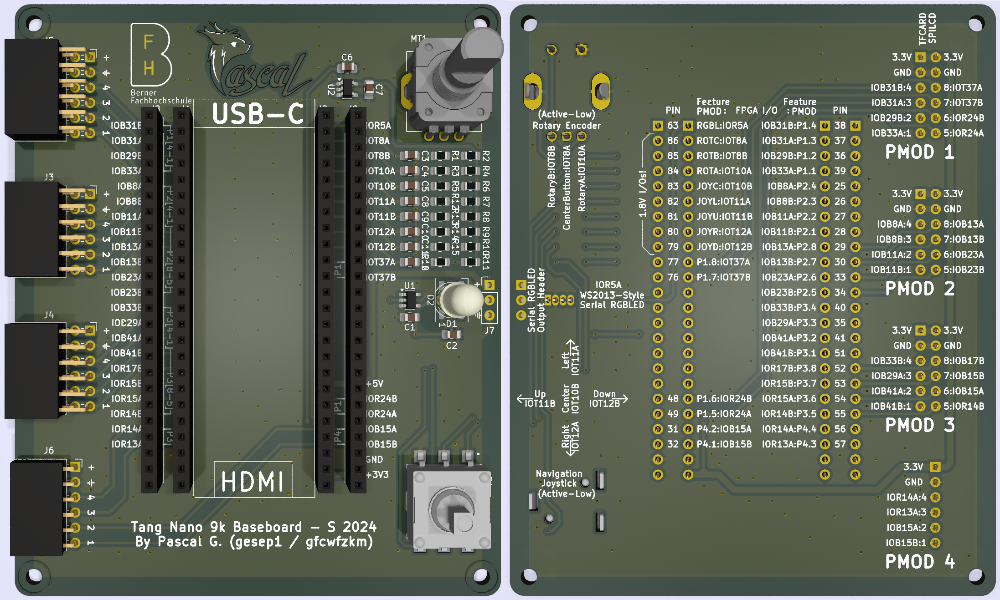
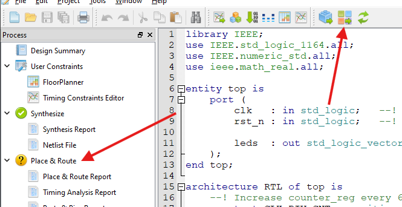

# t9k-baseboard
Tang Nano 9k Baseboard for Tang Nano 9k FPGA Board.



## Introduction

The main idea is to have a baseboard for the Tang Nano 9k FPGA Board that allows to use it in a more comfortable way.
The baseboard will feature four PMOD connectors, a rotary encoder, a navigation switch and a WS2813-Style 8mm RGB LED.

*A small FPGA dev environment for ~30 CHF!*

The target goal of this project is to give students and hobbyists a platform to learn and experiment with FPGA technology in a more comfortable and cheap way. This project received generous support from the [Bern University of Applied Sciences (BFH)](https://www.bfh.ch/ti/en/). Thank you!

With cost being a main target, the Sipeed Tang Nano 9k FPGA Board was chosen as the base for this project. The board is available for around 14$ and features a Gowin GW1NR-9C with 8640 LUT4. The board is also equipped with a 32Mbit SPI Flash, a 27 MHz clock and a USB-C connector for programming and power.

The baseboard has been designed to be used with either a vanilla Tang Nano 9k Board, or one with the 1.13" SPI Display attached.
While the bigger, parallel RGB displays can still be used, the user will have a lot less PMODs available without conflicts to the display.

## Files
In the `kicad` folder, you will find the KiCad project files for the baseboard.
The project has been designed using KiCad 8.

In the `docs` folder, you will find the [BOM](docs/BOM.pdf) of this project for 10 PCBs, a [PDF schematic](docs/SCHEMA.pdf) of the board and a [Pinmap Table](docs/Pinmap.pdf) to help you assign the various I/Os in code.

## Getting Started
If you haven't gotten the board and the components yet, check out the [BOM](docs/BOM.pdf) to see what you need.

The board has been designed to be hand-assembled, so all you need is a fine soldering iron, tweezers and some solder.

On the software side, you can either use the open source YOSYS toolchain or the official Gowin tools. The board has been tested with the Gowin tools, so you might want to start with those. I recommend getting the full Gowin EDA (not the Educational one) and either request a free license or use Sipeed's license server. Sipeed has an guide on how to setup the IDE [here](https://wiki.sipeed.com/hardware/en/tang/Tang-Nano-Doc/install-the-ide.html).

## Starting a new project on Gowin EDA
This section will guide you through the process of starting a new project on the Gowin EDA.
- Start `GOWIN FPGA Designer` and start a new project by clicking on `File -> New -> New Project...` or by simply clicking `New Project` on the Quick Start page.

- Use a project name of your choice and select the path where you want to store the project. Click `Next`.

- When the `Select Device` window pops up, ensure that the final part number is `GW1NR-LV9QN88PC6/I5` and click `Next`


- The project is now created and you can start adding files to it. To add or create files, right-click on the project in the `Design` tab and select `New File...`


- You can now add a new Verilog or VHDL file to the project. This guide will use VHDL. Name the file `top` (, change the file ending to .vhdl) and click `OK`.

- Paste in the following code - a simple counter that will use the six LEDs on the Tang Nano 9k board
```vhdl
library IEEE;
use IEEE.std_logic_1164.all;
use IEEE.numeric_std.all;
use ieee.math_real.all;

entity top is 
	port (
		clk   : in std_logic;	--! Clock input @ 27 MHz
		rst_n : in std_logic;	--! Active low reset

		leds  : out std_logic_vector(5 downto 0)	--! Output port for the LEDs
	);
end top;

architecture RTL of top is
	-- Increase counter_reg every 6_750_000 clock cycles
	constant CLK_DIV_CNT : positive := 6_750_000;
	-- Width of the CLK_DIV_CNT constant
	constant count_width : integer := integer(ceil(log2(real(CLK_DIV_CNT))));
	
	signal counter_reg : unsigned(5 downto 0)				:= (others => '0');
	signal clkdiv_reg  : unsigned(count_width-1 downto 0)	:= (others => '0');
begin
	-- Assign the counter value to the LEDs
	leds <= std_logic_vector(counter_reg);
	
	-- Counter and clock divider
	COUNTER : process (clk, rst_n) begin
		if rst_n = '0' then
			-- Reset the counter and clock divider
			counter_reg <= (others => '0');
			clkdiv_reg <= (others => '0');
		elsif rising_edge(clk) then
			-- Increment the clock divider
			clkdiv_reg <= clkdiv_reg + 1;

			-- Check if the clock divider has reached the desired value
			if clkdiv_reg = to_unsigned(CLK_DIV_CNT, count_width) then
				-- Reset the clock divider and increment the counter
				clkdiv_reg <= (others => '0');
				counter_reg <= counter_reg + 1;
			end if;
		end if;
	end process COUNTER;
end architecture RTL;
```

- Before the code can be synthesized, the VHDL standard needs to be set to 2008. This is because the math_real library isn't compiled on Gowin EDA for VHDL-1993. To do this, click on `Project -> Configuration` and select `Synthesize -> General`. Set the `VHDL Language` to `VHDL 2008` and click `OK`

- Now you can synthesize the code by clicking on the top tool bar on `Synthesize` or by double-clicking `Synthesize` in the `Process` tab


- **Nice to know:** You can double-click in the `Process` tab the `Synthesis Report` to see the synthesis results and resource usage of the design. In the menu bar `Tools -> Schematic Viewer -> Design Viewer` you can see the schematic of the design, if you are interested in that.

- Before `Place & Route` can be done, the pinout of the design needs to be set. To do this, click on `Tools -> Floor Planner` menu item. The tool will warn you that no Constraint File is in the project - click `OK` to create one.

- In the `Floor Planner` window, click on the `Package View` tab to get a overview of the FPGA's pins. To assign the various signals in the VHDL file to the pins, open the `I/O Contraints` tab at the bottom of the window


- Using the [Pinmap Table](docs/Pinmap.pdf) in the `docs` folder, assign the signals to the pins by either typing the location / pin number or by drag-n-dropping the signals to the pins in the `Package View`. Also pay attention to the voltage level of the signals. The Pinmap Table will tell you if a signal is 3.3V or 1.8V, so you have to set the `IO Type` to either `LVCMOS33` or `LVCMOS18` respectively. As for the `rst_n` signal, this guide will use the on-board button `S1`


- After all the I/Os have been assigned to a location, click on `File -> Save` to save the constraints file. You can now close the `Floor Planner` window

- Now you can do the `Place & Route` by clicking on the top tool bar on `Place & Route` or by double-clicking `Place & Route` in the `Process` tab



- After the `Place & Route` process has finished, you can download / program the design to the FPGA by clicking on the top tool bar on `Program` or by double-clicking `Program Device` in the `Process` tab


- The `Gowin Programmer` window will open. Click on `USB Cable Settings`, hit `Query/Detect Cable` and click `Save`


- You can now click on `Program` (The play-style button) to program the design to the FPGA. The LEDs on the Tang Nano 9k board should now count up and pressing S1 should reset it

Congratulations! You have now successfully created a simple design for the Tang Nano 9k FPGA Board using the Gowin EDA. You can find the this project and more in the `examples` folder.