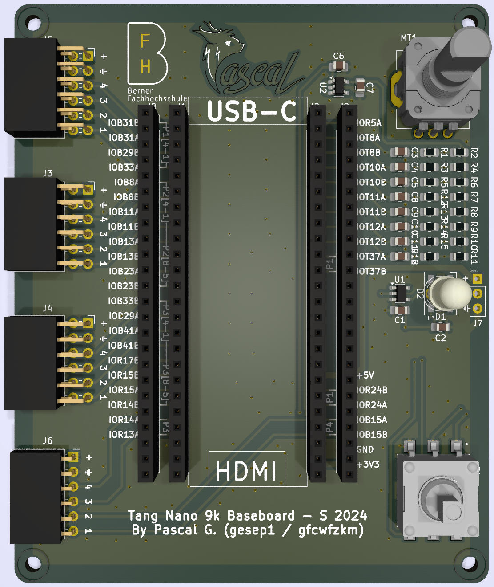

# t9k-baseboard
Tang Nano 9k Baseboard for Tang Nano 9k FPGA Board.

The main idea is to have a baseboard for the Tang Nano 9k FPGA Board that allows to use it in a more comfortable way.
The baseboard will feature four PMOD connectors, a rotary encoder, a navigation switch and a WS2812-Style 8mm RGB LED.

The target goal of this project is to give students and hobbyists a platform to learn and experiment with FPGA technology in a more comfortable and cheap way.
That is why this project relies on Sipeed's Tang Nano 9k FPGA Board, which is a low-cost FPGA board that is perfect for beginners.

The baseboard has been designed to be used with either a vanilla Tang Nano 9k Board, or one with the 1.13" SPI Display attached.
While the bigger, parallel RGB displays can still be used, the user will have a lot less PMODs available without conflicts to the display.

## Files
In the `kicad` folder, you will find the KiCad project files for the baseboard.
The project has been designed using KiCad 8.

In the `docs` folder, you will find the [BOM](docs/BOM.pdf) of this project for 10 PCBs, a [PDF schematic](docs/SCHEMA.pdf) of the board and a [Pinmap Table](docs/Pinmap.pdf) to help you assign the various I/Os in code.