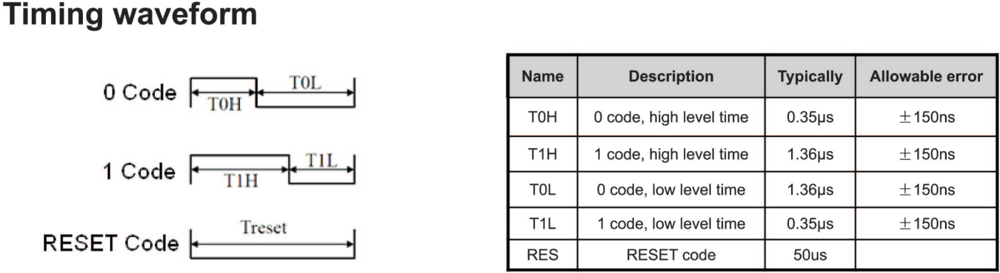

# RGB-LED and Rotary Encoder Example

This example demonstrates how to use the serial RGB LED and the rotary encoder.

The rotary encoder is [debounced](src/debouncer.vhdl) and it's quadrature signals are [turned](src/rotary_enc.vhdl) into a single increment and decrement signal.
These signals are used to [control a counter](src/cycle_colors.vhdl) in the range of 0 to 767, which represents the "hue" of the RGB color.
The hue allows to prettily cycle through the colors of the RGB LED.

The hue value is [converted to RGB](src/hsv_to_rgb.vhdl) values using a simple but effective algorithm. Proof of this conversion algorithms accuracy is left as an exercise to the reader.

> *I always wanted to write that!*

The converted RGB values are sent to the corresponding entity, which allows to [control the WS2812-style RGB LED](src/rgb_to_ser.vhdl). While the datasheet APA-106-F8 is very sparse, it states enough information to implement the serial protocol:

We need to send 24 bits of RGB data. The state of each bit is represented by a variable length of a high and a low signal. Using a counter and the clock speed of the FPGA, the amount of $f_{FPGA}$ we need to wait for to send a logic one or zero for each high or low signal can be calculated.

So all the state machine has to do, is to set the output high, wait the required amount of clock cycles for either a one or zero that the bit represents, then set the output low and wait again for the required amount of clock cycles. This is repeated for all 24 bits of the RGB data.

Finally, the [top entity](src/top.vhdl) wires everything together. It instantiates the debouncer, the rotary encoder, the cycle colors module, the HSV to RGB converter and the serial RGB LED module. If the rotary encoder has been incremented or decremented, the new color value is sent to the RGB LED, afterwards the "Reset Code" is sent to the RGB LED to reset the transmission, for new color values.