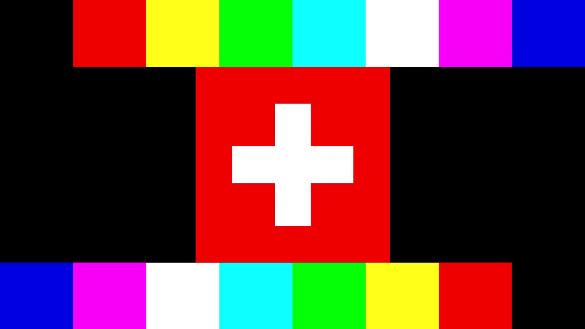

# HDMI VHDL Tang Nano 9k Demo

This is a simple demo of HDMI output using the Tang Nano 9k FPGA board.
The demo generates a simple test color pattern and shows the swiss flag on a 1280x720 HDMI display.

The code is documented and there are tests for the TMDS encoder. Otherwise write me or open up an issue if you have questions.



## Resource usage:

| Resource | Used | Utilization |
|----------|------|-------------|
| Logic Cells | 136 (121 LUT, 15 ALU) / 8640 | 2% |
| Register | 58 / 6693 | <1% |
| -- Register as Latch | 0 / 6693 | 0% |
| -- Register as FF | 58 / 6693 | <1% |
| BSRAM | 0 / 26 | 0% |
| PLL | 1 / 2 | 50% |
| CLKDIV | 1 / 8 | 13% |

## File Structure

```
/
├── README.md						This file
├── hdmi_demo.gprj					Gowin project file
├── hdmi_demo.gprj.user				Gowin project file
├── docs/							Documentation / Resources
│   ├── CEC_HDMI_Specification.pdf		HDMI Specification 1.3
│   └── dvi_spec-V1_0.pdf				DVI Specification 1.0
├── impl/							Synthesis and implementation results
├── src/							Source code
│   ├── hdmi_demo_top.vhdl				Top-level module
│   ├── hdmi_demo.cst					Physical constraints file (I/O pins placement)
│   ├── hdmi_demo.sdc					Timing Constraints file
│   ├── helper_pkg.vhdl					Helper package with function(s) for tmds_encoder.vhdl
│   ├── tmds_encoder.vhdl				TMDS encoder for HDMI/DVI
│   ├── video.vhdl						Video / Image generation module (Color bars, swiss flag)
│   ├── vtgen.vhdl						Video timing generator
│   ├── gowin_clkdiv/					Gowin-generated IP clock divider
│   └── gowin_rpll/						Gowin-generated IP PLL
└── tests/							Testbench and tmds python script
    ├── stimuli.csv						Stimuli for the TMDS encoder testbench
    ├── tb_tmds_encoder.vhdl			Testbench for the TMDS encoder
    ├── tb_tmds_encoder.fst				Testbench waveform output
    ├── tb_tmds_encoder.surf.ron		Surfer pin configuration file for waveform visualization
    └── tmds_check.py					Python script to check TMDS theory
```