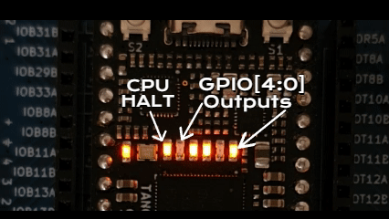
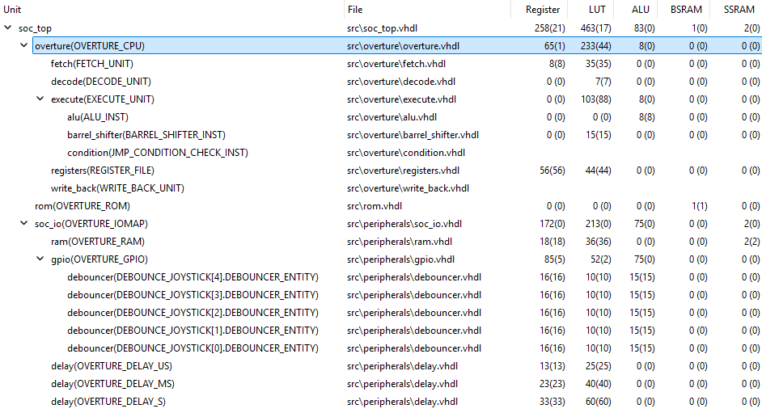
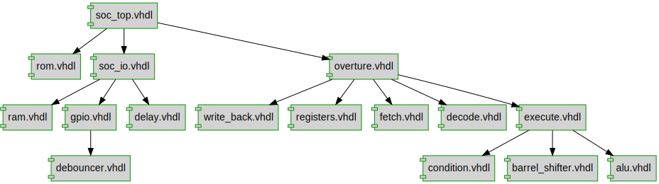
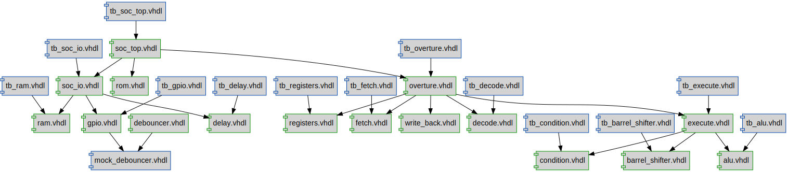

# Simple 8-bit CPU Example

This example demonstrates and explains how to implement a simple 8-bit CPU using VHDL.
The CPU is a basic design and has limited functionality, but serves as a good starting point for demonstation purposes. The Overture computer architecture from the game [Turing Complete](https://turingcomplete.game/) will be implemented with some slight modifications / additions.

In contrast to the other examples, this will have a more theoretical, educational focus. But if you don't care about that, just run and load the project on your FPGA board and have fun with it!

## Chapters
1. [Introduction](#1-introduction)
2. [The Instruction Set Architecture](#2-the-instruction-set-architecture)
   - [2.1 🔴🔴🟤🟤🟤🟤🟤🟤 Load Immediate Instruction](#21--load-immediate-instruction)
   - [2.2 🔴🟢🟤🟤🟤🟤🟤🟤 ALU/Compute Instruction](#22--alu-compute-instruction)
   - [2.3 🟢🔴🟤🟤🟤🟤🟤🟤 Copy Instruction](#23--copy-instruction)
   - [2.4 🟢🟢🟤🟤🟤🟤🟤🟤 Jump/Branch Instruction](#24--jumpbranch-instruction)
   - [2.5 Undefined Instructions](#25-undefined-instructions)
3. [CPU Architecture](#3-cpu-architecture)
4. [Fetch](#4-fetch)
5. [Decode](#5-decode)
6. [Execute](#6-execute)
7. [Register File](#7-register-file)
8. [Write Back](#8-write-back)
9. [Assembling the Overture CPU](#9-assembling-the-overture-cpu)
9. [I/O Operations](#9-io-operations)
10. [Assembler / Disassembler](#10-assembler--disassembler)
11. [Example Program](#11-example-program)
12. [Conclusion](#12-conclusion)
13. [File Structure](#13-file-structure)

## [1. Introduction](#chapters)

While state machines are a powerful tool to implement more complex logic, they can be cumbersome if a general-purpose design is needed, that can be easily modified and changed. A CPU is a good example of such a design, as it is basically just one big state machine that can be programmed to do different things.

In this example, we will implement a simple 8-bit CPU that can execute a small set of instructions. The CPU will be able to perform basic arithmetic operations, load and store data, and control the flow of execution. The design will be modular and easy to understand, making it a good starting point for more complex designs.

It will be implemented as a single-cycle CPU, meaning that each instruction will be executed in a single clock cycle. While the execution speed is not very high, due to the long datapath, it is a good starting point for understanding how a CPU works. The design is structured in a way that allows to modify it to an multi-cycle or pipelined design later on, if desired.

In this example, we will implement the Overture computer architecture from the game [Turing Complete](https://turingcomplete.game/). The ISA will be extended with some additional instructions to make it more versatile and useful for general-purpose programming. This computer architecture has a 1-byte wide ISA and *originally* contains 6 registers, although we extend it to 7 registers (R0 to R7). Some of these registers are used for special purposes, such as for ALU operations or the address on a jump/branch instruction. The computer also contains an input/output port, which can be used to read from and write to external devices. While no RAM is implemented in this example, our modified computer architecture is modified to easily support a RAM module.

> Such a modified, faster or more compact design is left as an exercise for the reader.

## [2. The Instruction Set Architecture](#chapters)

To run general purpuse programs, a CPU needs to have an instruction set architecture (ISA) that defines the instructions it can execute. The ISA is a set of instructions that the CPU can understand and execute. A ISA should define instructions to perform basic arithmetic and logical operations, load and store data, and control the flow of execution. It should also have instructions to interact with memory and I/O devices, such as reading from and writing to memory or I/O ports.

All registers can be used as general-purpose registers, but some of them have special purposes. The CPU has 7 registers (R0 to R6), each 8 bits wide, which can be used to store data and addresses. The registers are used to hold the operands for the ALU operations, the result of the ALU operations, and the address for jump/branch instructions.
The following registers are used, with their special purpose defined:

- **R0**: Used to load immediate values and as jump/branch destination.
- **R1**: Used as first operand for ALU operations.
- **R2**: Used as second operand for ALU operations.
- **R3**: Used to store the result of ALU operations.
- **R4**: General-purpose register with no special purpose.
- **R5**: General-purpose register with no special purpose.
- **R6**: Used to store the address to the I/O device for input/output operations.

In general, the ISA consists of the four main instruction types:

- 🔴🔴🟤🟤🟤🟤🟤🟤 Load Immediate Instruction
- 🔴🟢🟤🟤🟤🟤🟤🟤 ALU/Compute Instruction
- 🟢🔴🟤🟤🟤🟤🟤🟤 Copy Instruction
- 🟢🟢🟤🟤🟤🟤🟤🟤 Jump/Branch Instruction

> Note:
>
> A green circle 🟢 stands for an set bit (bit = 1), a red circle 🔴 for an cleared bit (bit = 0) and brown circle 🟤 for an "don't care" or not further specified bit. The left-most circle stands for the most-significant bit, in this case, bit 7 while the right-most circle represents bit 0.

### [2.1 🔴🔴🟤🟤🟤🟤🟤🟤 Load Immediate Instruction](#2-the-instruction-set-architecture)

The Load Immediate instruction is used to load a constant value into a register. It loads an 6-bit immediate value (0 to 63) into the register zero (R0).

### [2.2 🔴🟢🟤🟤🟤🟤🟤🟤 ALU/Compute Instruction](#2-the-instruction-set-architecture)

The ALU/Compute instruction is used to perform arithmetic and logical operations. The register one (R1) and register two (R2) are used as input operands, while the result is stored in register three (R3). The instruction also specifies the operation to be performed:

- 🔴🟢🟤🟤🟤🔴🔴🔴 **OR**
  - Bitwise OR operation between R1 and R2, result in R3.
- 🔴🟢🟤🟤🟤🔴🔴🟢 **NAND**
  - Bitwise NAND operation between R1 and R2, result in R3.
- 🔴🟢🟤🟤🟤🔴🟢🔴 **NOR**
  - Bitwise NOR operation between R1 and R2, result in R3.
- 🔴🟢🟤🟤🟤🔴🟢🟢 **AND**
  - Bitwise AND operation between R1 and R2, result in R3.
- 🔴🟢🟤🟤🟤🟢🔴🔴 **ADD**
  - Addition of R1 and R2, result in R3 (No carry / overflow detection).
- 🔴🟢🟤🟤🟤🟢🔴🟢 **SUB**
  - Subtraction of R2 from R1, result in R3 (No borrow / overflow detection).
- 🔴🟢🟤🟤🟤🟢🟢🔴 **XOR**
  - Bitwise XOR operation between R1 and R2, result in R3.
- 🔴🟢🟤🟤🟤🟢🟢🟢 **SHIFT**
  - Shift R1 to the left (R2 > 0) or right (R2 < 0) by the value in R2, result in R3. If R2 is 0, R1 is copied to R3.

### [2.3 🟢🔴🟤🟤🟤🟤🟤🟤 Copy Instruction](#2-the-instruction-set-architecture)

The Copy instruction is used to copy the value of one register to another register. The instruction specifies the source register (bits 3 to 5, yellow) and the destination register (bits 0 to 2, blue) 🟢🔴🟡🟡🟡🔵🔵🔵.

The following destination / sources are specified:

- 🔴🔴🔴 **R0**
  - Also used to load immediate values and as jump/branch destination.
- 🔴🔴🟢 **R1**
  - Also used as first operand for ALU operations.
- 🔴🟢🔴 **R2**
  - Also used as second operand for ALU operations.
- 🔴🟢🟢 **R3**
  - Also used to store the result of ALU operations.
- 🟢🔴🔴 **R4**
  - General-purpose register with no special purpose.
- 🟢🔴🟢 **R5**
  - General-purpose register with no special purpose.
- 🟢🟢🔴 **R6**
  - Used to store the address to the I/O device for input/output operations.
- 🟢🟢🟢 **INPUT / OUTPUT**
  - Used to read from or write to the I/O device port. The register R6 can be used to specify the address of the I/O device, if multiple devices are connected.


### [2.4 🟢🟢🟤🟤🟤🟤🟤🟤 Jump/Branch Instruction](#2-the-instruction-set-architecture)

The Jump/Branch instruction is used to control the flow of execution. It can be used to jump to a specific address or to branch to a different instruction based on a condition. The instruction does not specify the address to jump to, but instead uses the value in register zero (R0) as the address to jump to. Instead, it specifies the condition to branch on, which is determined by the value in register three (R3).

The following conditions are specified and a jump is performed if the condition is met:
- 🟢🟢🟤🟤🟤🔴🔴🔴 **Never branches**
- 🟢🟢🟤🟤🟤🔴🔴🟢 **R3 equals 0**
- 🟢🟢🟤🟤🟤🔴🟢🔴 **R3 less than 0**
- 🟢🟢🟤🟤🟤🔴🟢🟢 **R3 less than or equals 0**
- 🟢🟢🟤🟤🟤🟢🔴🔴 **Always jump**
- 🟢🟢🟤🟤🟤🟢🔴🟢 **R3 not equal zero**
- 🟢🟢🟤🟤🟤🟢🟢🔴 **R3 greater than equals zero**
- 🟢🟢🟤🟤🟤🟢🟢🟢 **R3 greater than 0**

## [2.5 Undefined Instructions](#2-the-instruction-set-architecture)

Some keen readers might have noticed that the instruction set architecture does not define all possible instructions.The game simply never specified what the other instructions should do, so they are left undefined.

If the CPU encounters an undefined instruction, it will simply **halt execution** and do nothing, forcing a reset of the CPU and thus preventing unexpected behavior.

## [3. CPU Architecture](#chapters)

The CPU architecture is a single-cycle design, meaning that each instruction is executed in a single clock cycle. We also need to define the inputs and outputs of the CPU, the internal components, and the connections between them.

The CPU has the following inputs and outputs:
- **Inputs:**
  - `clk`: The clock signal, used to synchronize the CPU.
  - `reset`: The active-high reset signal, used to reset the CPU.
  - `instruction`: The instruction to be executed, provided by the instruction memory.
  - `io_in`: The input data from the I/O device, if any.
- **Outputs:**
  - `instruction_addr`: The address of the instruction to be executed, used to fetch the instruction from the instruction memory.
  - `io_addr`: The address of the I/O device, if any.
  - `io_out`: The output data to the I/O device, if any.
  - `io_write_enable`: The write enable signal for the I/O device, if any.
  - `cpu_halted`: Indicates that the CPU has halted execution and is waiting for a reset.

The CPU's memory is placed externally, allowing to easily change the program that is executed. The CPU will fetch the instruction from the instruction memory, decode it, execute it, and write back the result to the registers or the I/O device.

The CPU architecture is split into five different components, which allows each intermediate step to be easily simulated and verified. The architecture consists of the following components:
- **Instruction Fetch Unit (FE)** : Fetches the instruction from the instruction memory and provides it to the decode unit.
- **Instruction Decode Unit (DE)** : Decodes the instruction and provides the necessary control signals to the execute unit.
- **Execute Unit (EX)** : Executes the instruction and performs the necessary operations, such as ALU operations or jump condition checks.
- **Write Back Unit (WB)** : Writes back the result of the instruction to the registers or the I/O device.
- **Register File** : Stores the registers R0 to R6, which are used to hold data and addresses.

In the following sections, we will implement each of these components in detail and explain how they work together to execute the instructions.

## [4. Fetch](#chapters)

The Fetch Unit is responsible for fetching the instruction from the instruction memory. It has an program counter (PC) that holds the address of the instruction to be fetched and executed. During normal operation, the PC is incremented by 1 after each instruction fetch, but it can also be set to a specific address if a successful jump/branch instruction is executed. The PC is reset to 0 when the CPU is reset, and when the CPU is halted, the PC is not incremented anymore.

The Fetch Unit has the following inputs and outputs:
- **Inputs:**
  - `clk`: The clock signal, used to synchronize the Fetch Unit.
  - `reset`: The active-high reset signal, used to reset the Fetch Unit.
  - `perform_jump`: Signal to indicate to load `jump_addr` into the PC instead of incrementing it.
  - `halt`: Signal to indicate that the CPU is halted and the PC should not be incremented anymore.
  - `jump_addr`: The address to jump to, if a jump/branch instruction is executed.
  - `memory_data`: The data read from the instruction memory, which is the instruction to be executed.
- **Outputs:**
  - `memory_addr`: The address of the instruction to be fetched, used to fetch the instruction from the instruction memory.
  - `fetched_instruction`: The instruction to be executed, fetched from the instruction memory.

Given the simplicity of the Fetch Unit, simply a 8-bit counter needs to be implemented, which either increments by 1, is set to a specific address or is held at the current address if the CPU is halted. The counter is reset to 0 when the CPU is reset. No special handling is added in case of an roll-over of the program counter.

```vhdl
...
--! Process to handle the program counter
PROGRAM_COUNTER : process(clk, reset) begin
    if rising_edge(clk) then
        if reset = '1' then
            -- Reset the program counter to 0 on reset
            program_counter_reg <= (others => '0');
        else
            if halt = '1' then
                -- Do not increment the program counter if the CPU is halted
                program_counter_reg <= program_counter_reg;
            else
                -- Increment the program counter or set it to the jump address
                if perform_jump = '1' then
                    program_counter_reg <= unsigned(jump_addr);
                else
                    program_counter_reg <= program_counter_reg + 1;
                end if;
            end if;
        end if;
    end if;
end process PROGRAM_COUNTER;
...
```

See [fetch.vhdl](src/overture/fetch.vhdl) to see the full implementation of the Fetch Unit, alongside with the [testbench](testbench/tb_fetch.vhdl) to verify its functionality.

## [5. Decode](#chapters)

The Decode Unit is responsible for decoding the fetched instruction and generating the necessary control signals for the Execute Unit. It takes the fetched instruction as input and outputs the control signals, which are used to control the execution of the instruction.

The Decode Unit has the following inputs and outputs:
- **Inputs:**
  - `fetched_instruction`: The instruction to be decoded, fetched from the Fetch Unit.
- **Outputs:**
  - `instruction_type`: The type of the instruction, which is used to determine how to execute it.
  - `alu_op`: The ALU operation to be performed, based on the instruction.
  - `src_reg`: The source register for the copy instruction.
  - `dest_reg`: The destination register for the copy instruction.
  - `jump_condition`: The condition for the jump/branch instruction.
  - `immediate_value`: The immediate value for the load immediate instruction.
  - `halt`: Signal to indicate that the CPU is halted and no further instructions should be executed.

The implementation is straightforward, as we simply extract the relevant bits from the fetched instruction. Based on the instruction type, we set the control signals accordingly. My implementation uses the source and destination register bits also for immediate and ALU instructions, to set the destination registers or to get the second operand for the ALU operations. The decoder also sets the halt signal to '1' if the decoder encounters an undefined instruction. The source register is directly used to forward the corresponding register value to the Execute Unit.

See [decode.vhdl](src/overture/decode.vhdl) to see the full implementation of the Decode Unit, alongside with the [testbench](testbench/tb_decode.vhdl) to verify its functionality.

## [6. Execute](#chapters)

The Execute Unit is responsible for executing the decoded instruction. It takes the control signals from the Decode Unit and performs the necessary operations, such as ALU operations or jump condition checks. Since the ALU operations take the registers R1 and R2 as input operands, the Execute Unit also needs access to the Register File to read the values of these registers. The jump condition checks are also performed in the Execute Unit, using the value of register R3 to determine whether to jump or branch.

To ease up development and testing, the Execute Unit is split into three parts; the ALU, the Compare Unit for jumps/branches and a barrel shifter for shift operations.

The Execute Unit wires these components together and directs the data flow between them. It has the following inputs and outputs:
- **Inputs:**
  - `instruction_type`: The type of the instruction, which is used to determine how to execute it.
  - `alu_op`: The ALU operation to be performed, based on the instruction.
  - `jump_condition`: The condition for the jump/branch instruction.
  - `dst_reg`: The destination register for the copy instruction.
  - `alu_operand_a`: The first operand for the ALU operation, which is the value of register R1.
  - `source_register`: The contents of the source register, used for copy, jump/branch and ALU (operand B) instructions.
  - `immediate_value`: The immediate value for the load immediate instruction, which is loaded into register R0.
- **Outputs:**
  - `instruction_type`: The type of the instruction, which is used to determine how to execute it, forwarded to the next unit.
  - `dst_reg`: The destination register for the copy instruction, forwarded to the next unit.
  - `result_data`: The result of the ALU operation, the immediate value or the value to copy to the destination register.
  - `condition_result`: The result of the jump/branch condition check, which is used to determine whether to jump or branch.

## [7. Register File](#chapters)

The Register File is responsible for storing the registers R0 to R6. It provides read and write access to the registers, with direct access to the registers R1 to R3 for the Execute Unit. The Register File also provides access to the I/O device address register R6, which is used to read from and write to the I/O device. Finally, direct access to the register R0 is provided to the Fetch Unit, to load in a new address if a valid jump/branch condition has been met. The values of these registers are updated by the Write Back Unit, at the end of the instruction execution.

So at the end, the Register File simply consists of a 7-element array of 8-bit registers, which can be read and written to. The Register File has the following inputs and outputs:

- **Inputs:**
  - `clk`: The clock signal, used to synchronize the Register File.
  - `reset`: The active-high reset signal, used to reset the Register File.
  - `write_enable`: The write enable signal, used to enable writing to the registers.
  - `write_data`: The data to be written to the registers.
  - `write_reg`: The register to write to (R0 to R6).
  - `read_reg`: The register to read from (R0 to R6), used by the Copy instruction.
- **Outputs:**
  - `read_data`: The data read from the registers.
  - `jump_address`: The value of register R0, used as jump/branch destination.
  - `alu_operand_a`: The value of register R1, used as the first operand for ALU operations.
  - `io_address`: The value of register R6, used as the address for the I/O device.

```vhdl
...
-- Read data from the specified register
read_data_o <= x"00" when read_address_i = "111" else register_file(to_integer(unsigned(read_address_i)));
    
-- Direct outputs for special registers
jump_address_o  <= register_file(0); -- Register 0 holds the jump address
alu_operand_a_o <= register_file(1); -- Register 1 holds the ALU operand A
io_address_o    <= register_file(6); -- Register 6 holds the I/O address

--! Clock process for register file
CLKREG : process (clk_i, reset_i)
begin
    if rising_edge(clk_i) then
        if reset_i = '1' then
            register_file <= (others => (others => '0')); -- Reset all registers to 0
        else
            register_file <= register_file; -- Keep current state
            
            if write_enable_i = '1' and unsigned(write_address_i) < register_file'length then
                -- Write data to the specified register
                register_file(to_integer(unsigned(write_address_i))) <= write_data_i;
            end if;
        end if;
    end if;
end process CLKREG;
...
```

See [register_file.vhdl](src/overture/registers.vhdl) to see the full implementation of the Register File, alongside with the [testbench](testbench/tb_registers.vhdl) to verify its functionality.

## [8. Write Back](#chapters)

The Write Back Unit is responsible for writing back the result of the instruction execution to the registers or the I/O device. It takes the result of the instruction execution from the Execute Unit and writes it to the destination register or the I/O device, depending on the instruction type. It has to control the write enable signal for the Register File and the I/O device, to ensure that the data is written correctly.

The Write Back Unit has the following inputs and outputs:
- **Inputs:**
  - `instruction_type`: The type of the instruction, which is used to determine how to write back the result.
  - `dst_reg`: The destination register for the copy instruction, which is used to determine where to write the result.
  - `result_data`: The result of the instruction execution, which is written back to the destination register or the I/O device.
- **Outputs:**
  - `register_data`: The data to be written to the destination register, which is the result of the instruction execution.
  - `register_write_enable`: The write enable signal for the Register File, which is set to '1' if the instruction writes to a register.
  - `register_write_address`: The address of the destination register, which is used to write the result to the Register File.
  - `io_data`: The data to be written to the I/O device, which is the result of the instruction execution.
  - `io_write_enable`: The write enable signal for the I/O device, which is set to '1' if the instruction writes to the I/O device.

```vhdl
...
--! Write Back process that handles the final stage of instruction execution
--! It determines whether to write back to registers or I/O based on the instruction type
WB : process (instruction_type_i, dst_reg_i, result_data_i)
begin

    register_data_o <= result_data_i; -- Default output for register data
    registers_write_address_o <= dst_reg_i;
    io_data_o <= result_data_i;
    registers_write_enable_o <= '0';
    io_data_write_enable_o <= '0';

    case instruction_type_i is
        when "00" | "01" => -- Load immediate or ALU operation
            registers_write_enable_o <= '1'; -- Enable register write
        when "10" => -- I/O operation
            if dst_reg_i = "111" then -- Write to io
                io_data_o <= result_data_i; -- Write data to I/O
                io_data_write_enable_o <= '1'; -- Enable I/O write
            else
                registers_write_address_o <= dst_reg_i; -- Write to register
                registers_write_enable_o <= '1';
            end if;
        when others =>
            -- No write-back for other instruction types
            null;
    end case;

end process WB;
...
```

See [writeback.vhdl](src/overture/write_back.vhdl) to see the full implementation of the Write Back Unit.

## [9. Assembling the Overture CPU](#chapters)

The Overture CPU is assembled from the individual components we have implemented so far. The Fetch Unit, Decode Unit, Execute Unit, Register File and Write Back Unit are connected together to form the complete CPU. The only additional logic needed here, is to select the `source_register` based on the source register address:

```vhdl
source_register_EX <= io_data_read_i when src_reg_addr_DE_RF = "111" else read_register_RF_EX;
io_data_read_enable_o <= '1' when src_reg_addr_DE_RF = "111" else '0';
```

The other signal assignment is a simple signal to let the I/O peripherals know, that a read is being performed / requested on them. This was first not planned but as I started to work on some I/O peripherals, I realized that this would be really nice to have.

See [overture.vhdl](src/overture/overture.vhdl) to see the full implementation of the Overture CPU, alongside with the [testbench](testbench/tb_overture.vhdl) to verify its functionality. The testbench runs a few basic programs to verify that the CPU works as expected.

## [9. I/O Operations](#chapters)

> **WIP**: This section is a work in progress and will be completed in the future.

A CPU in itself is not very useful, if it cannot interact with the outside world or with other internal components. To make the CPU more versatile, some I/O operations are implemented, which allow the CPU to read from and write to external devices - external devices being non-overture-CPU components, be it within the FPGA or outside of it.

To interface with these I/O devices, the CPU provides the following signals:
```vhdl
--! I/O address output for reading/writing data
io_address_o            : out std_logic_vector(7 downto 0);
--! I/O data read input for reading data from I/O
io_data_read_i          : in std_logic_vector(7 downto 0);
--! I/O data write output for writing data to I/O
io_data_write_o         : out std_logic_vector(7 downto 0);
--! I/O data write enable output for controlling write operations to I/O
io_data_write_enable_o  : out std_logic;
--! I/O data read enable signal to let the I/O module know that data is being read
io_data_read_enable_o   : out std_logic;
```

The I/O interface is far from perfect. It expects the data to be ready or written as soon as a read or write operation is requested. It is not possible to wait for the data to be ready or to signal that the data is ready. This is a limitation of the current design, but it is sufficient for simple I/O operations.

At the current moment, three kind of I/O peripherals are implemented:
- **RAM** (0x00 - 0x0F): A simple RAM module that can be used to store data and instructions. It is implemented as a 16-byte wide memory.
- **GPIO** (0x10) : A simple GPIO module, currently used to read the debounced joystick inputs and write to the five LED outputs.
- **Delay μs** (0x11): A simple delay module that can be used to create delays in the program execution. Upon writing a value to the delay module, it will count down the value in microseconds until it reaches zero.
- **Delay ms** (0x12): A simple delay module that can be used to create delays in the program execution. Upon writing a value to the delay module, it will count down the value in milliseconds until it reaches zero.
- **Delay s** (0x13): A simple delay module that can be used to create delays in the program execution. Upon writing a value to the delay module, it will count down the value in seconds until it reaches zero.

Other modules, that are currently planned but not yet implemented, are:
- **UART**: A simple UART module that can be used to communicate with other devices.
- **RGBLED**: A simple RGB LED module that can be used to control the on-board serial RGB LED.

Take a look at the [I/O peripherals top module](src/peripherals/soc_io.vhdl) as well as the corresponding individual modules, and the testbenches.

## [10. Assembler / Disassembler](#chapters)

> **WIP**: This section is a work in progress and will be completed in the future.

Of course I got sidetracked after having written a few very simple test programs for the CPU, realizing how annoying it is to write the instructions in binary even if it's for a few lines of code. Heavily inspired by the [article series by Brian Robert Callahan](https://briancallahan.net/blog/20210407.html), I began working on an disassembler for my modified Overture CPU.

The **[disassembler.py](disassembler.py)** is a simple Python script, capable of disassembling a binary or hex-string file into a human-readable assembly code. It supports all the instructions defined in the Overture CPU ISA, including the extended instructions for I/O and shift operations. 

Since the Overture CPU in the game Turing Complete has no official assembly language, I had to come up with my own:

```assembly
; Overture CPU Assembly Language (this is a comment)

start:               ; This is a label, used to mark an address in the program
COUNTER EQU 15       ; Define a constant, used to set the value of the counter
ANOTHER = 12         ; You can use the equal sign to define a constant, too

; Macros are supported to easily add custom pseudo instructions:
%macro LJMP address  ; Macro to load an address and jump to it
  LDI address        ; Load the address into R0
  JMP                ; Jump to the address in R0
%endmacro

; There are various ways to load immediate values into R0:
LDI start ; Load the address of the label 'start' into R0
LDI 12    ; Load immediate value 12 into R0
LDI 0b11  ; Load immediate value 3 into R0
LDI 0x3F  ; Load immediate value 63 into R0
LDI #3F   ; Load immediate value 63 into R0

; There are 8 ALU operations available, performing the operation on R1 and R2, storing the result in R3:
; You can either use the operations name directly, or use it with the prefix `OP ` to make it more obvious.
OR        ; R3 = R1 OR R2
NAND      ; R3 = R1 NAND R2
OP NOR    ; R3 = R1 NOR R2, with the OP prefix example
AND       ; R3 = R1 AND R2
ADD       ; R3 = R1 + R2
SUB       ; R3 = R1 - R2
XOR       ; R3 = R1 XOR R2
SHIFT     ; R3 = R1 << R2 (if R2 > 0) or R1 >> -R2 (if R2 < 0), if R2 = 0, R3 = R1

; The Copy / Move instruction is used to copy the value from one register to another.
; Since I like `MOV` more than `COPY` or `CPY`, I decided to name it `MOV`:
; It is also used to access the I/O device, but there is an optional alternative syntax for that.
MOV R1, R2 ; Copy the value of R2 to R1
MOV R1, R0 ; Copy the value of R0 to R1

MOV IO, R2 ; Copy the value of R2 to the I/O device
OUT R2     ; Write the value of R2 to the I/O device, alternative syntax
MOV R2, IO ; Copy the value of the I/O device to R2
IN R2      ; Read the value from the I/O device into R2, alternative syntax

; There are 7 jump/branch instructions available (technically 8, but one never branches):
; Make sure to load the jump address into R0 before using these instructions!

JZ    ; Jump if R3 == 0
JLZ   ; Jump if R3 < 0
JLEZ  ; Jump if R3 <= 0
JMP   ; Jump unconditionally
JNZ   ; Jump if R3 != 0
JGEZ  ; Jump if R3 >= 0
JGZ   ; Jump if R3 > 0

; The 8th non-branching jump instruction is defined as a NOP:
NOP   ; No operation, does nothing, but can be used to fill gaps in the program

LJMP start  ; We can use the macro to load in the address of 'start' and jump to it

HLT  ; This instruction emits a illegal instruction (0xFF), which will halt the CPU and wait for a reset.
; Is this still an illegal instruction when I make actual use of it? I don't know, but it works for now.
```

Because I have defined multiple ways to state some operations, the disassembler has been written to be flexible and use either one or the other variation of the syntax using flags:
```text
$> python disassembler.py --help
usage: disassembler.py [-h] [--hex] [--output OUTPUT] [--io-pseudo] [--ldi-hex] [--alu-no-op] input_file

Disassembler for Overture CPU

positional arguments:
  input_file       Input file (binary or hex text)

options:
  -h, --help       show this help message and exit
  --hex            Treat input as hex text file
  --output OUTPUT  Output file (default: stdout)
  --io-pseudo      Treat IO as MOV pseudo-register instead of IN/OUT
  --ldi-hex        Display LDI immediates in hex format (with # prefix)
  --alu-no-op      Remove OP prefix from ALU instructions
```

With the language defined, the disassembler can simply parse the binary or hex-string file and convert it into the above assembly code. It does not support macros, labels or constants but it's good enough in my opinion.

The more challenging part is to write an **[assembler](assembler.py)**, which takes the assembly code and converts it back into a binary or hex-string file. The assembler is implemented in the same Python script and supports the same assembly language as the disassembler. It can handle labels, constants and macros, making it easy to write programs for the Overture CPU.

In a first step, the assembler reads line by line, removes comments, splits it up into tokens per line and memorizes labels, constants and macros. In a second step, it converts these tokens into the corresponding binary instruction, adds the labels and constants into the instruction as needed, and expands the macros into the corresponding instructions. 

The assembler can only output a binary, but also a pure disassembler-like dump, a hex-string or a vhdl array. If no file path is specified, it will output the binary to stdout.
```text
$> python assembler.py --help
usage: assembler.py [-h] [--output OUTPUT] [--format {binary,hex,dump,vhdl}] input_file

Assembler for Overture CPU

positional arguments:
  input_file            Input assembly file

options:
  -h, --help            show this help message and exit
  --output OUTPUT       Output file (default: stdout)
  --format {binary,hex,dump,vhdl}
                        Output format
```


> **NOTE:**
>
> The assembler and disassembler are specifically written for this modified Overture CPU and its instruction set architecture. They are not fully compatible with the original Overture CPU from the game Turing Complete, as it does not have a 7th register (R6) for I/O operations as I do. If you want to use the assembler and disassembler with the original Overture CPU, you will need to modify the code accordingly. Feel free to open an issue or pull request if you want to contribute to this project and make the assembler and disassembler compatible with the original Overture CPU.

## [11. Example Program](#chapters)

Currently, only one program has been written, which works on both the [simulator](testbench/tb_soc_top.vhdl) and the FPGA. It is a simple program, calculating the first 7 values of the [Fibonacci sequence](https://en.wikipedia.org/wiki/Fibonacci_sequence), writing the current calculated value to the GPIO output and into the RAM. It also uses the delay ms peripheral to slow down execution, so that the values can be seen changing on the GPIO output.

Once all values have been calculated, the program will halt and wait for a reset.



Please take a look at the [fibonacci.s](soc_software/fibonacci.s) file, which contains the assembly code for the program. The program is written to make use of the assemblers features, such as labels, constants and macros.

## [12. Conclusion](#chapters)

Lets get to the ressource usage first! The Overture CPU has been somewhat written to be small and efficient, but with the I/O peripherals, I've gotten a bit lazy. Especially the delay peripherals are quite large, as they use a large counter to count the CPU cycles down to microseconds, milliseconds or seconds steps. Using the Gowin FPGA Designer Version V1.9.11.03, the resource usage is as follows:



The Overture CPU uses 65 registers, 233 LUTs and 8 ALU elements. The I/O peripherals use an additional 172 registers, 213 LUTs and 75 ALU elements. Even better, the timing summary of the `Place & Route` step shows a maximum frequency of **31.972 MHz**, ~5 MHz higher than the native 27 MHz oscillator attached to the FPGA. This turns out to faster than I expected, as the CPU has a very long data path from [ROM](src/rom.vhdl) to the [Register File](src/overture/registers.vhdl) and the round trip of the Register File itself.

The Overture CPU is a simple CPU, which can be written by a keen student in a week or two, more if they go down the rabbit holes of writing an assembler and disassembler. It is a good starting point to learn about CPU design, instruction set architectures and VHDL programming.

Personally, I'm quite happy with the result, even if it is not perfect. The CPU is simple enough to be easily understood but complex enough to perform actual instructions and interact with I/O devices. I'm not sure where I will continue from here... I could explore pipelining using this simple CPU or I could go towards a more complex and usable CPU design, such as a RISC-V CPU. I'm also very tempted to expand on the I/O peripherals, like adding a UART or a video text output peripheral. Time will tell how bored I'll get to go down these rabbit holes.

I hope this serves as a good introduction to the Overture CPU and its design. If you have any questions, suggestions or feedback, feel free to open an issue / discussion on the repository or contact me directly.

## [13. File Structure](#chapters)

All testbenches are automated and can be run using the provided `run_testbenches.py` script, which uses the [NVC](https://github.com/nickg/nvc) as VHDL simulator - alternatively it can work with GHDL, but that has not been tested yet.

The synthesis hierarchy is as follows:



With the testbenches (blue boxes), it looks like this:



The file structure of the Overture CPU project is as follows:

```
04_simple_cpu/
│   assembler.py                        - Assembler for this Overture CPU
│   disassembler.py                     - Disassembler for this Overture CPU
│   overture_cpu.gprj                   - Gowin FPGA Designer project file
│   overture_cpu.gprj.user              - Gowin FPGA Designer user project file
│   README.md                           - This file
│   run_testbenches.py                  - Run all testbenches in the project using NVC
│
├───images                              - Images used in the README and docs
│       simple_cpu.png
│       turing_complete_conditions.png
│
├───impl                                - Gowin Synthesis and Place & Route results
│
├───soc_software                        - Software for the Overture CPU
│       fibonacci.s                       - Example Fibonacci program for the Overture CPU
│
├───src                                 - Source code folder for the Overture CPU
│   │   overture_cpu.cst                  - Gowin Synthesis Physical Constraints file
│   │   overture_soc.sdc                  - Gowin Synthesis Timing Constraints file
│   │   rom.vhdl                          - ROM for the Overture CPU, containing the program
│   │   soc_top.vhdl                      - Top module for the Overture CPU, instantiates the CPU and I/O peripherals
│   │
│   ├───overture                        - Overture CPU source code
│   │       alu.vhdl                      - ALU operations for the Overture CPU
│   │       barrel_shifter.vhdl           - Barrel shifter for the Overture CPU
│   │       condition.vhdl                - Jump/branch condition checks for the Overture CPU
│   │       decode.vhdl                   - Decode unit for the Overture CPU
│   │       execute.vhdl                  - Execute unit for the Overture CPU, uses ALU, barrel shifter and condition
│   │       fetch.vhdl                    - Fetch unit for the Overture CPU
│   │       overture.vhdl                 - Top module for the Overture CPU, connects all components
│   │       registers.vhdl                - Register file for the Overture CPU, stores R0 to R6
│   │       write_back.vhdl               - Write back unit for the Overture CPU, writes results to registers or I/O
│   │
│   └───peripherals                     - I/O peripherals for the Overture CPU
│           debouncer.vhdl                - Debouncer for the joystick inputs
│           delay.vhdl                    - Delay module for the Overture CPU, counts down in μs, ms or s
│           gpio.vhdl                     - GPIO module for the Overture CPU, reads joystick inputs and writes to LEDs
│           ram.vhdl                      - RAM module for the Overture CPU, 16 bytes wide
│           soc_io.vhdl                   - Top module for the I/O peripherals, connects all peripherals
│
├───surfer                              - Surfer Waveform Viewer files to quickly setup the testbench waveforms
│       tb_overture.surf.ron              - Surfer file for the Overture CPU testbench
│       tb_ram.surf.ron                   - Surfer file for the RAM testbench
│       tb_soc_io.surf.ron                - Surfer file for the I/O peripherals testbench
│       tb_soc_top.surf.ron               - Surfer file for the SoC top testbench
│
└───testbench                           - Testbenches for the Overture CPU and its components
        mock_debouncer.vhdl               - Mock debouncer for the joystick inputs
        tb_alu.vhdl                       - Testbench for the ALU operations
        tb_barrel_shifter.vhdl            - Testbench for the barrel shifter
        tb_condition.vhdl                 - Testbench for the jump/branch condition checks
        tb_decode.vhdl                    - Testbench for the decode unit
        tb_delay.vhdl                     - Testbench for the delay module
        tb_execute.vhdl                   - Testbench for the execute unit
        tb_fetch.vhdl                     - Testbench for the fetch unit
        tb_gpio.vhdl                      - Testbench for the GPIO module
        tb_overture.vhdl                  - Testbench for the Overture CPU, connects all components
        tb_ram.vhdl                       - Testbench for the RAM module
        tb_registers.vhdl                 - Testbench for the register file
        tb_soc_io.vhdl                    - Testbench for the I/O peripherals
        tb_soc_top.vhdl                   - Testbench for the SoC top module, connects the CPU and I/O peripherals
```
